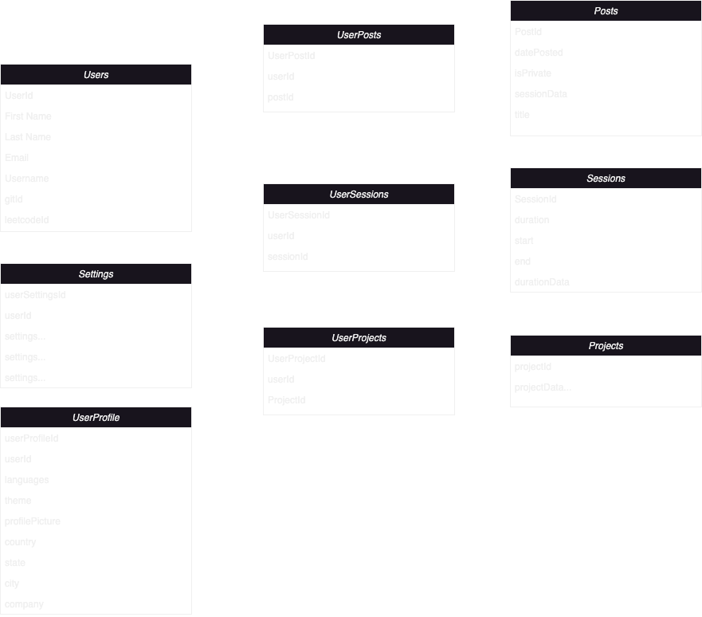
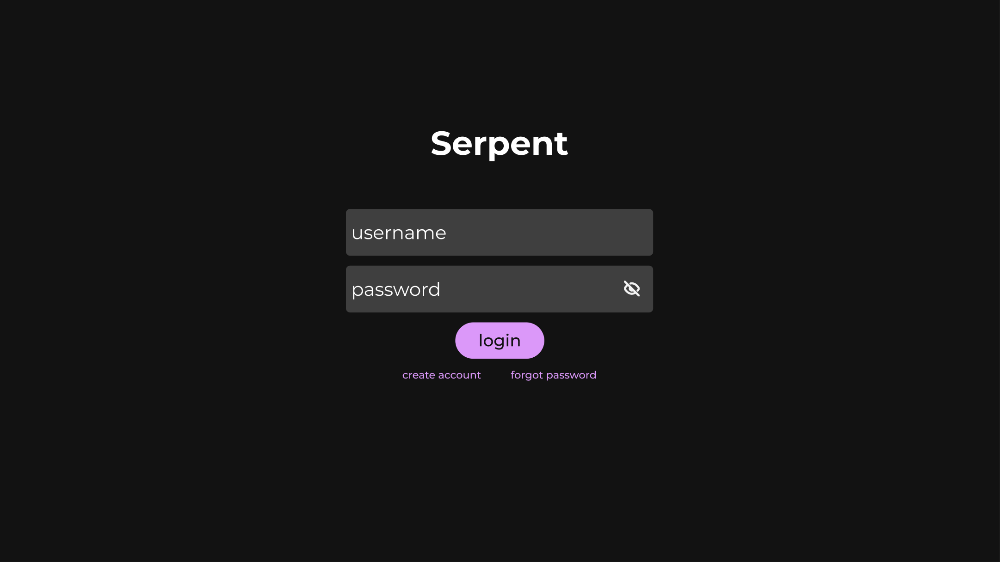
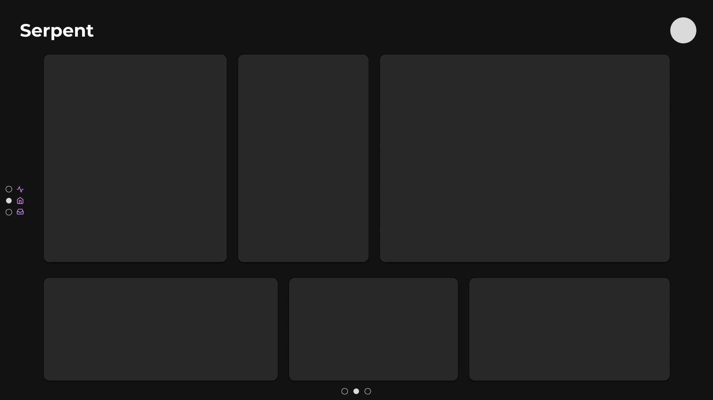
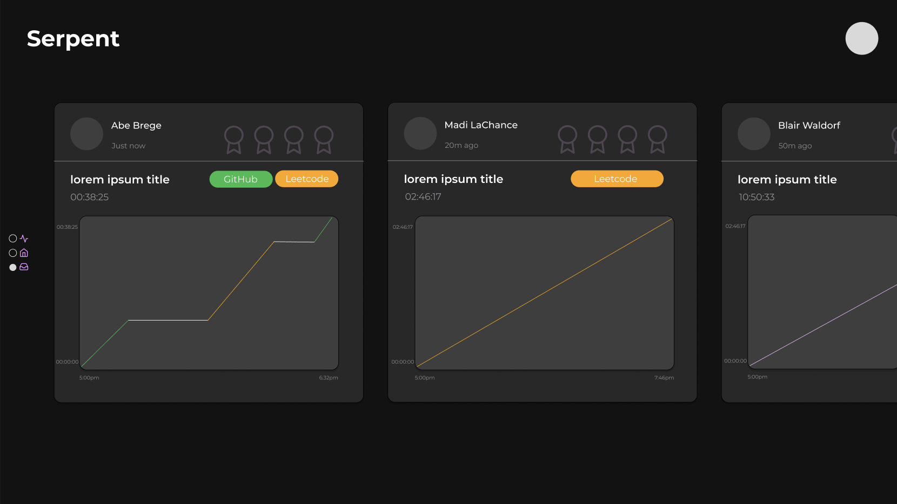
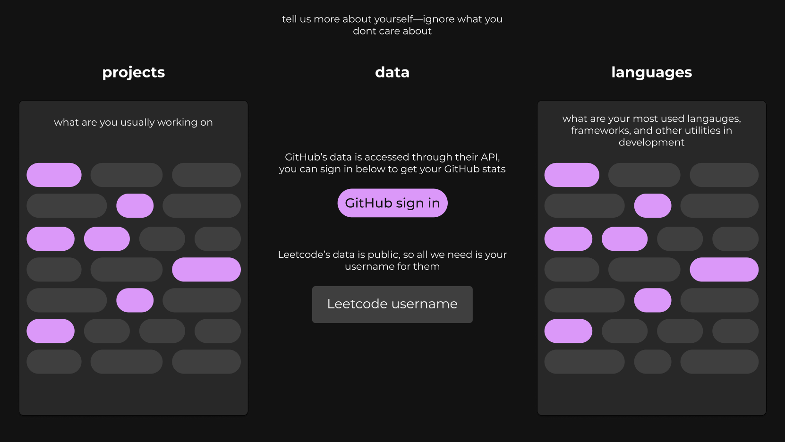
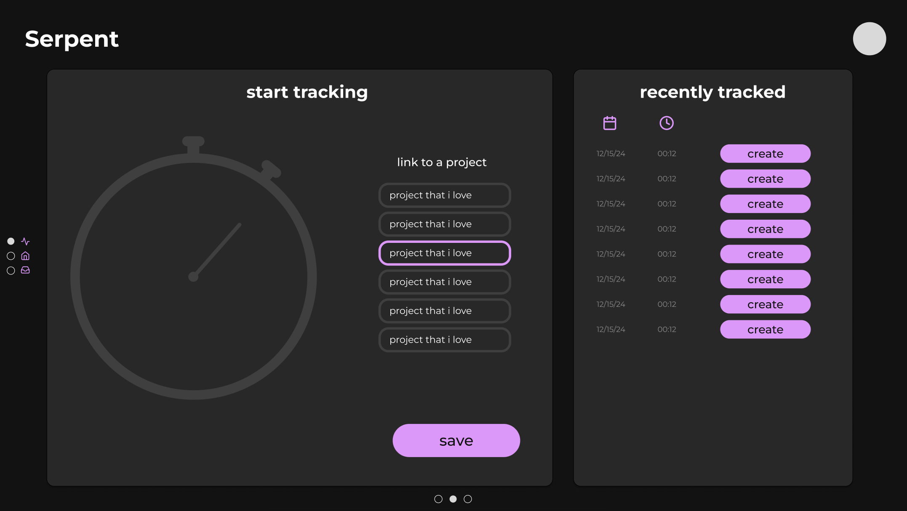

 
Serpent is an app that [I am](http://abrege11.github.io) creating for my senior project at Northern Michigan University for the Winter 2025 semester.

## Overview
The goal of Serpent is to be the Strava of programming. It shocks me that no one has made a tracking app for the group of people who create the tracking apps. Programmers—some the most type A people alive, for some reason don't have a cool way of tracking their progress.

## The Vision
There are two ways that programmers track their progress as of now.
1. Leetcode
2. Github

### Github
There are two aspects of tracking, what kind of data you present and how you present it. Github does a great job with the data that they present. Their data is very ambiguous, very flexible. Tracking commits means you can track from any kind of project. Hell, you could make a github repo for your Leetcode problems and track your Leetcode progress that way if you wanted to. They win on data right now, but they are in the stone age on visuals. Their dashboard is horrible to use, it isn't pretty, and most of the data is boring anyways.
### Leetcode
Leetcode is the opposite. It's data is domain specific by nature—Leetcode would never track more than Leetcode problems. This data is lacking compared to Githubs, but they blow them out of the water with the visuals. A beautiful dashboard, I think some people Leetcode solely for the dashboard.

### Serpent
Quantum computing engulfs classical computing by being able represent 0 and 1, along with a superposition of all states at once.
  Serpent engulfs Leetcode and Github by using their API's to get all of their data, while also tracking an even broader form of data—__time-based data__. Likewise, the visual pleasure of only having the data you care about from the other two, displayed on a beautiful dashboard.

## Functionality
1. **Github and Leetcode stats for a user**
 &nbsp;- Github has a very generous API rate limit at 5000 requests per hour per user. Leetcode uses GraphQL, so their data is public.

2. **A social aspect, seeing others progress**
 &nbsp;- Not that I want a social media app, but most apps benefit from a social aspect. Everyone likes making an account and showing off.

3. **Ability to track time spent on projects**
 &nbsp;- A VS Code extension will be essential. I want the user to be able to start, pause, and stop a timer and then link that time to a project you have on Github or a problem you did on Leetcode. Alternately, I want the user to be able to pencil in the activity if needed. Like if it's a school assignment that you don't have any tracking for, or work that you cant link to a private repo.

4. **A gorgeous dashboard**
 &nbsp;- I want to pull the best data from the two API's along with things like time spent, maybe a calendar streak, maybe most worked on project. I'd like to make it modular if possible, allowing the user to customize what they want to see.

5. **Get to it if I can / future plans**
 &nbsp;- So I'd like to explore maybe tracking words typed, maybe how many functions you wrote, or how many times you used a certain word, or how many times you used a certain function. Now, I don't know if this is even possible, let alone legal to take text from the user's vs environment, but if it could work it would be cool.

## Stack
I am going to use Next.js along with MySQL for the database, and host everything on my own home server.

## Mockups
I have begun designing the potential frontend interface, along with the database structure. Below you can see both.

### Database structure

### Login

### Dashboard

### Feed

### Preferences

### Tracking
